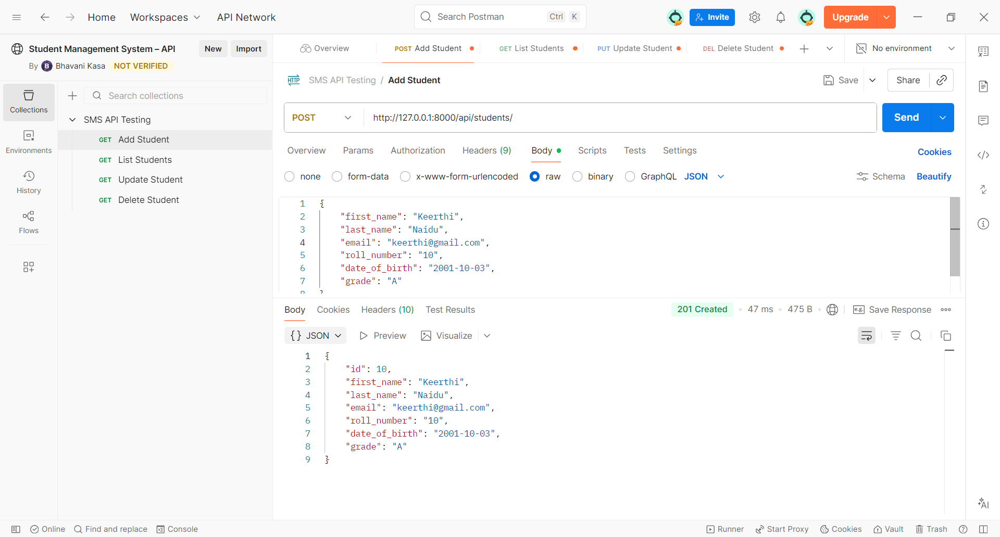
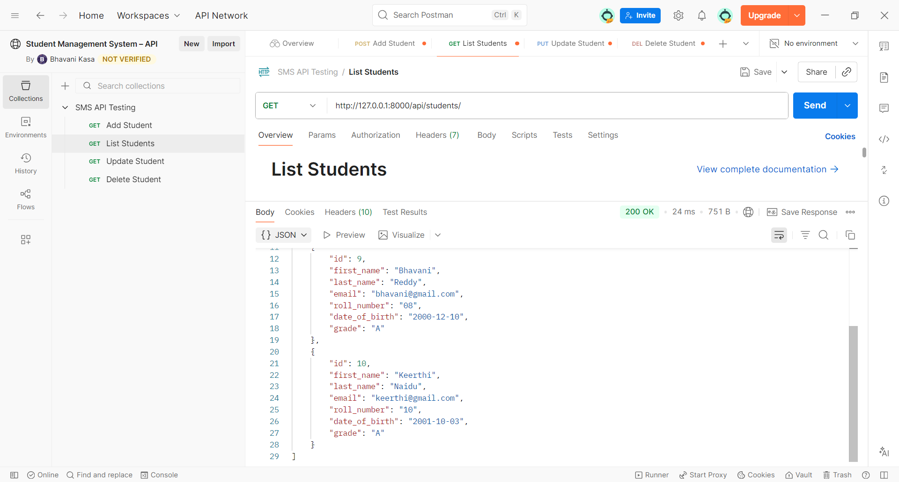
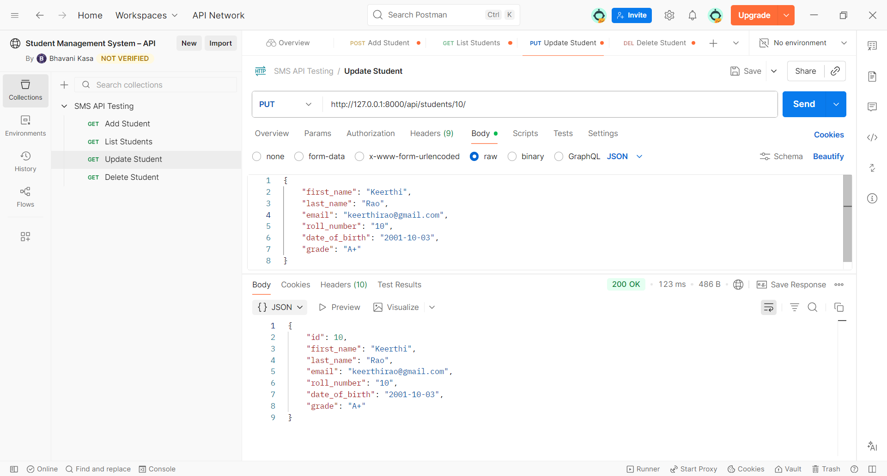

# Student Management System


## 📌 Project Description

**Student Management System** - A robust RESTful application developed using **Python, Django, and Django REST Framework (DRF)** to efficiently manage student records. It provides scalable API endpoints with full CRUD operations, data validation, and unique constraints on email and roll numbers. Leveraging Django's MVT architecture and DRF serializers, the system ensures clean, maintainable, and well-structured code. The project also integrates Django Admin for easy data management and uses **Postman** for thorough API testing and validation.

---
## 🛠️ Tech Stack

- **Backend:** Python, Django, Django REST Framework (DRF)

- **Database:** SQLite (default Django database)

- **API Testing:** Postman

- **Tools:** Git, GitHub, VS Code

---
## 🚀 Key Features

- Create a new student record including details such as **First Name, Last Name, Email, Roll Number, Date of Birth, and Grade**
- Update existing student information
- Delete student records
- View all student records
- Router-based URL configuration
- Django Admin integration
- RESTful API endpoints for CRUD operations
- Easy API testing via Postman
- Unique validation for Email and Roll Number

---
## 📁 Project Structure

```
student_management/
├── sms_project/            # Django project folder
├── students/               # Django app for student management
│   ├── models.py           # Student model
│   ├── serializers.py      # DRF serializers
│   ├── views.py            # API viewsets
│   └── urls.py             # App URLs
├── manage.py
├── venv/                   # Virtual environment
├── .gitignore
├── README.md
├── requirements.txt        # Project dependencies
├── screenshots/            # Postman Screenshots 
│    ├── create_student.png
│    ├── get_students.png
│    ├── update_student.png
│    └── delete_student.png
  
```
---
## 🧩 Application Architecture

The project follows Django's standard MVT (Model-View-Template) architecture, adapted for REST APIs.

## 🔹 Model (models.py)
Defines the Student database structure:
- first_name
- last_name
- email (Unique)
- roll_number (Unique)
- date_of_birth
- grade

```
class Student(models.Model):
    first_name = models.CharField(max_length=50)
    last_name = models.CharField(max_length=50)
    email = models.EmailField(unique=True)
    roll_number = models.CharField(max_length=20, unique=True)
    date_of_birth = models.DateField()
    grade = models.CharField(max_length=5)

    def __str__(self):
        return f"{self.first_name} {self.last_name}"
```
 ---
 ## 🔹 Serializer (serializers.py)
 Converts model instances to JSON and validates input data.

 ```
 class StudentSerializer(serializers.ModelSerializer):
    class Meta:
        model = Student
        fields = '__all__'
```
---
## 🔹 ViewSet (views.py)
This class implements full CRUD operations using Django REST Framework's ModelViewSet.

```
class StudentViewSet(viewsets.ModelViewSet):
    queryset = Student.objects.all().order_by('id')
    serializer_class = StudentSerializer
```
---
## 🔹 Routing (urls.py)
Uses DRF's DefaultRouter for automatic route generation.

`API Base URL: http://127.0.0.1:8000/api/students/ `

## Supported HTTP Methods:

- GET - List all students

- POST - Create a new student 

- PUT - Update student details

- DELETE - Remove a student 

---
## 📡 API Documentation

`Base URL: http://127.0.0.1:8000/api/students/`

All responses are returned in **JSON format**.

---
## 🔹 1. Create a new Student

**Endpoint**:
POST /api/students/

**Description**:
Creates a new student record.

**Request Body**:
```
{
   "first_name": "Keerthi",
   "last_name": "Naidu",
   "email": "keerthi@gmail.com",
   "roll_number": "10",
   "date_of_birth": "2001-10-03",
   "grade": "A"
}
```
**Success Response (201 Created)**:
```
{
   "id": 10,
   "first_name": "Keerthi",
   "last_name": "Naidu",
   "email": "keerthi@gmail.com",
   "roll_number": "10",
   "date_of_birth": "2001-10-03",
   "grade": "A" 
}
```

**Postman Screenshot**: 


**Error Response (400 Bad Request)**:

- Returned when required fields are missing or validation fails.
- Example: Duplicate email or roll number.
---
## 🔹 2. Retrieve All Students
**Endpoint**:
GET /api/students/

**Description**:
Retrieves a list of all student records.

**Success Response (200 OK)**:
```
[
   {
      "id":9,
      "first_name": "Bhavani",
      "last_name": "Reddy",
      "email": "bhavani@gmail.com",
      "roll_number": "08",
      "date_of_birth": "2000-12-10",
      "grade": "A" 
   },
   {
      "id":10,
      "first_name": "Keerthi",
      "last_name": "Naidu",
      "email": "keerthi@gmail.com",
      "roll_number": "10",
      "date_of_birth": "2001-10-03",
      "grade": "A" 
   }
]
```
**Postman Screenshot**: 


---
## 🔹 3. Update Student
**Endpoint**:
PUT /api/students/10/

**Request Body**:
```
{
   "first_name": "Keerthi",
   "last_name": "Rao",
   "email": "keerthirao@gmail.com",
   "roll_number": "10",
   "date_of_birth": "2001-10-03",
   "grade": "A+"  
}
```
**Success Response (200 OK)**:

Returns the updated student object.
**Postman Screenshot**:


---
## 🔹 4. Delete Student
**Endpoint**:
DELETE /api/students/10/

**Success Response (204 No Content)**:

The student record is successfully deleted.

**Postman Screenshot**:


---
## 📌 Validation Rules
- Email must be unique
- Roll number must be unique
- All fields are required
- Date of birth must be in YYYY-MM-DD format

---
## 🧪 API Testing 
All endpoints were tested using **Postman**, validating:
- Request payloads
- Response data
- HTTP status codes
- Validation errors

---
## 📦  Requirements
- Python 3.10+
- Django 4+
- Django REST Framework

---
## ⚙️ Installation & Setup


1. **Clone the repository**:

```bash
git clone https://github.com/bhavanikasa05/student_management.git

cd student_management
```

2. **Create a virtual environment**:
```
   python -m venv venv

   # Activate the virtual environment 

   # Windows:
   venv\Scripts\activate

   # Mac/Linux:
   source venv/bin/activate
```

3. **Install dependencies**:
```
   pip install -r requirements.txt
```

4. **Apply database migrations**:
```
   python manage.py makemigrations
   python manage.py migrate
```
5. **Create a superuser (Optional)**:
```
   python manage.py createsuperuser
```
Access admin panel:
  
   http://127.0.0.1:8000/admin/

 ---

 **Run Development Server**:
```
  python manage.py runserver
```
Access API Endpoint:

http://127.0.0.1:8000/api/students/

---
## 🔮 Future Enhancements
- JWT Authentication
- Pagination & Filtering
- Search functionality
- Swagger docs using drf-yasg

---
## 🎯 Learning Outcomes
Through this project, I strengthened my understanding of:
- REST API development
- Django project structure
- Database modeling and validation
- Serializer and ViewSet implementation
- API testing using Postman
- Backend project structuring for production readiness

---
## 👩‍💻 Author
Bhavani Kasa

**GitHub**: https://github.com/bhavanikasa05
 
    

        


